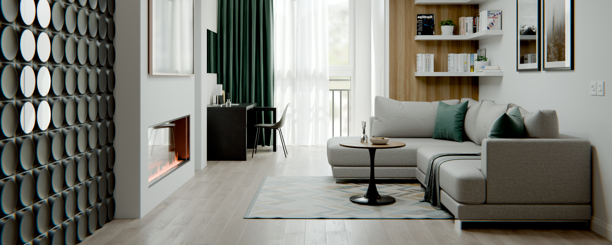
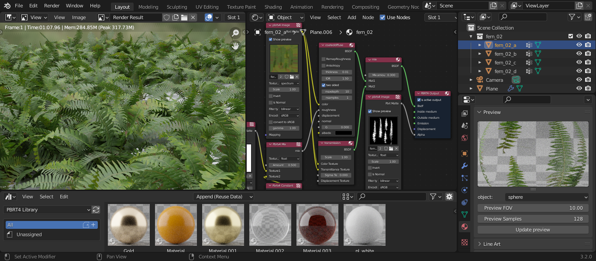

# bpbrt4 for Windows

### pbrt-v4 Render Engine/Exporter Add-on for Blender

Based on the `mesh_ply.py` code from the Blender Mitsuba Add-on.

Tested in Blender `4.4`

### Installation

- Download the code as a ZIP archive.
- In Blender, go to **Edit** -> **Preferences** -> **Add-ons** or **Get Extensions** -> **Install from Disk**.
- Select the downloaded ZIP archive.
- Find the add-on using the search bar and enable it.

### How to Use

- Set up your scene.
- Set the path to the pbrt-v4 bin folder (under the Render Properties tab).
- Set the path to the project folder (where you want to export) (under the Render Properties tab).
- Hit the Render button.

Render progress and information messages are printed to the console (enable the console under **Window** -> **Toggle System Console**).

### Supported Versions

The current version of bpbrt4 is suitable for Blender `4.x` versions.
The add-on version for Blender `3.x` is available at the branch [Blender3x](https://github.com/NicNel/bpbrt4/tree/Blender3x).
My experiments with pbrt-v4 code (Disney shader implementation) are available at [pbrt-v4 fork](https://github.com/NicNel/pbrt-v4).

