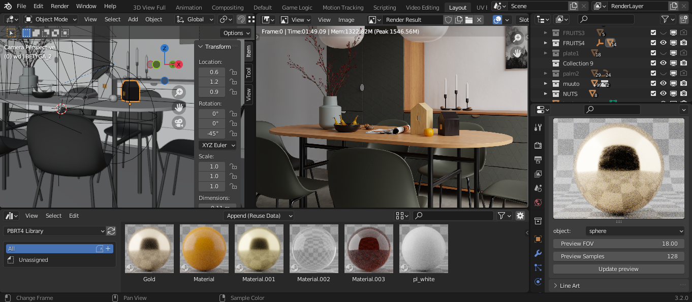

# bpbrt4 for Windows (Early Release)
## pbrt-v4 render engine/exporter add-on for Blender
Based on mesh_ply.py from Blender Mitsuba Add-On
(tested in Blender 2.9)

### How to use
- set up the scene
- set path to pbrt-v4 bin folder (under render properties tab)
- set path to project (where to export) folder (under render properties tab)
- hit render button

Render progress and info messages are printed the console (enable the console under Window -> Toggle System Console).

